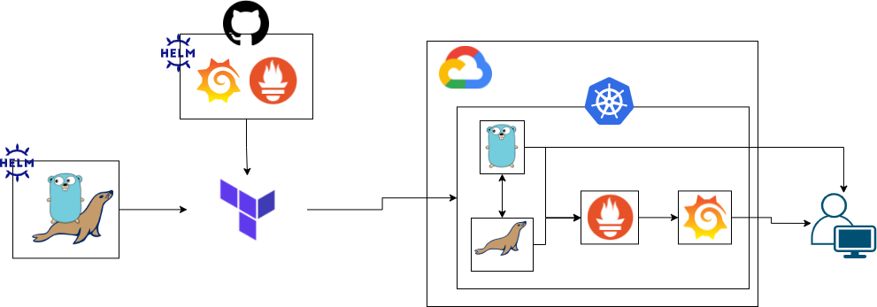
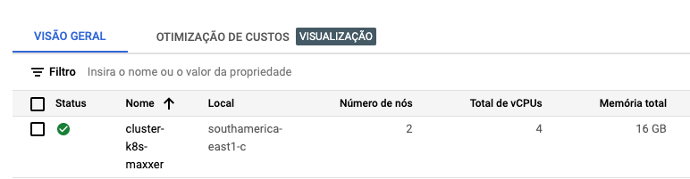
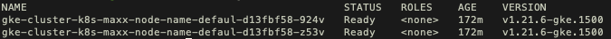
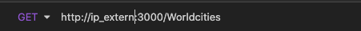
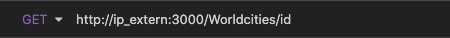
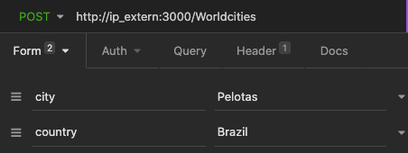
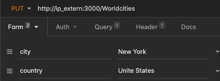

# Overview
---

-

The project described here provides the necessary files to upload a Kubernetes cluster on the Google Cloud Platform using Terraform.

GKE has a toy service locale installed via helm chart, it also has prometheus and grafana to perform cluster monitoring.

The chart was created locally and has a mariadb database to carry out the consumption. The Dockerfile for creating the image used to create the service and database used here is also provided.

## Toy Service
---
First we have a simple API written in golang. Its function is nothing more to be a crud of cities in the world, providing the id, city and country. Allowing the main functions:
- [x] /GET
- [x] /POST
- [x] /PUT
- [x] /DELETE

The API can be viewed at:
[IMAGE AQUI]

Inside the folder contains the Dockerfile used to generate the image that is available in my dockerhub. To do this, just run the command:

```Shell
$ docker built -t name_dockerhub/name_image:tag .
```

Note that the images will be downloaded directly from dockerhub as they were created outside the custer, in a development environment, that is, they do not yet exist in the cluster.

The database chosen for the project was Mariadb because it is opensource. Inside the mariadb folder there is also the dockerfile for creating the image and the worldcities.sql file that is used to populate our database.

## Helm Chart
---
Inside the deployment folder, the templates used for testing were created before creating the chart. So just create the chart in a simple way to be deployed via terraform in our GKE.

for the locally created chart, variables were used in order to facilitate possible image updates such as through the variables:
>helm/citys-world/Chart.yaml

As also possible user exchanges in the database. It is also worth noting that it is still possible to "activate" or "disable" the metrics, if we want to deploy a collector like prometheus.

```yaml
# Prometheus
metrics: 'false'

# Service consume DB
version: latest


# MariaDB
mariadb:
  version: latest
  rootpassword: RootPassword
```

to monitor the GKE cluster, taking advantage of the implementation of the first chart, I followed the same path for the implementation of prometheus and grafana, thus making use of two online chart repositories:

|chart | repositories|
|------|-------------|
|Prometheus| https://prometheus-community.github.io/helm-charts |
|Grafana | https://grafana.github.io/helm-charts|

## Terraform
---

For the project, a GKE was raised using terraform, for the infra, two points were considered:

```HCL
region = "southamerica-east1-a"
type-machine = "n2-standard-2"
```

This concern comes from saving my credits at GCP and being closer to my location :information_desk_person:
to run the project you need to enter your credentials, in the file:
>variables.tf

change the variable:
```HCL
gcp_credentials = "your_credentials.json"
```

To use another cloud just adjust the file:
>providers.tf

In the same way as for any change in the configuration of the current cluster, just change the file's default values (as done with the credentials above):
>variables.tf

Or create a new file called variables.auto.tfvars to override the default values proposed here.

## Execute project
----

To execute the project, just run it step-by-step as described by the commands below (it is noteworthy that this is OS independent):

```Shell
$ terraform init

$ terraform plan

$ terraform apply
```

now we can connect to our GKE using gcloud sdk from the command line:

```Shell
$ gcloud container clusters get-credentials name_cluster --zone zona_selected --project name_project
```

in the case of the default project, just use:

```Shell
$ gcloud container clusters get-credentials cluster-k8s-maxxer --zone southamerica-east1-c --project maxxer-test
```

now we can see if our cluster was actually created, either by the kubectl command or by the graphical console interface.

Console Google


Command kubectl:

```Shell
$ kubectl get nodes
```



still using the kubectl command we can see if all our charts have been installed and are running

```Shell
$ kubectl get pods -n worldcities

$ kubectl get pods -n monitoring

$ kubectl get svc -A
```

With the last command in the list we can get the external ip of our cluster and use it to test our toy service using some tool or the terminal.

for the toy service tests I used the insomnia tool, below I present the prints of the model tests.





